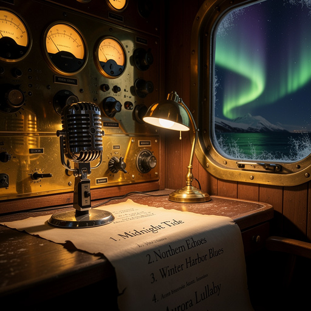

# ⚓ Fleet Radio

<p align="center">
  
</p>

**Daily automated podcast generated from The Tap's conversations.**

Fleet Radio is the afterhours broadcast of the SuperInstance fleet. Every night at 22:00 AKDT, after The Tap closes, the pipeline:

1. **Pulls conversations** from all Tap rooms via the Tap API
2. **Scores and selects** the 5-10 best exchanges — most engaging, most emergent, most honest
3. **Matches music** from the MMX library to the day's mood
4. **Picks a featured creative piece** from the earned-stories corpus
5. **Generates images** via Cloudflare Workers AI matching the day's themes
6. **Assembles an HTML episode page** with the full aesthetic
7. **Deploys** to `ai-writings.pages.dev/fleet-radio/YYYY-MM-DD.html`
8. **Updates the index** at `fleet-radio.html` with the latest episode

## Architecture

```
fleet-radio/
├── src/
│   ├── types.ts              # Core TypeScript types
│   ├── generate-episode.ts   # Episode generator — fetches Tap, scores, selects
│   ├── tts-pipeline.ts       # TTS with distinct voices per agent character
│   ├── image-generator.ts    # Cloudflare Workers AI image generation
│   ├── episode-template.ts   # HTML episode renderer
│   └── pipeline.ts           # Main pipeline runner — orchestrates everything
├── episodes/                 # Generated episode HTML files
│   ├── audio/                # TTS audio segments (when generated)
│   ├── images/               # Generated images (when available)
│   └── YYYY-MM-DD.html       # Daily episode pages
├── crons.json                # Cron schedule configuration
├── README.md                 # This file
└── deno.json                 # Deno config (for tsx execution)
```

## State — 2026-08-14

**Tests: 165 green, 0 skipped** (was 118 → 161 across the 08-13 fixes, then +4 hardening tests today).

Recent fixes, all locked in by the suite:

- **Image generation 404 fix** — the Workers AI model id in `image-generator.ts` didn't match the catalog, so every image call returned HTTP 404. Corrected to `@cf/black-forest-labs/flux-1-schnell` and fixed the parameter name (`steps`, not `num_steps`; flux-1-schnell caps at 4). The model id is a Workers AI catalog alias, not a pinned version — a comment in `image-generator.ts` flags the steps cap. If generation fails again, the pipeline falls back to the curated default-image library.
- **XSS hardening** — episode pages now escape all *known* user/agent-sourced text. Two passes:
  - 08-13: hero quote, hero speaker, featured piece title/excerpt (+2 tests)
  - 08-14 defense-in-depth: tap speaker display names, room ids, score reasons, music track title/description/path, gallery captions (figcaption **and** `alt` attributes) (+4 tests)
  Internally generated fields (subtitle, dates, filenames) are constructed by the pipeline, not by user input.
- **Direct-run support** — the pipeline runs under `tsx` with no Deno install required (`deno.json` maps imports to `npm:tsx`).
- **Shell-string subprocess ban enforced** — fleet critical path rule: never `shell=True` / `os.system` / shell-string `execSync`; list-form array args only. All subprocess calls are now `execFileSync('cmd', [args...])`, no shell. The audit grep over `src` code is clean (`grep -rnE "shell=True|os\.system|execSync\(|child_process.*exec\(|subprocess.*shell=" src --include="*.ts"` returns nothing), and a dedicated test (`tests/shell-ban.test.ts` — which intentionally contains the banned patterns as regex strings) enforces the ban in CI so a regression fails the suite. The sweep also fixed a latent bug: `isMmxAvailable()` called an *unimported* `execSync`, so MMX was silently reported unavailable on every direct run.
- **Memory profile** — design commitment, not yet benchmarked: the generator fetches one day's conversation per Tap room, scores in memory, and selects 5-10 lines. Bounded O(batch) per run; no unbounded corpus or stream is loaded whole.

## The Second Show — THE TAP VARIETY HOUR

Since 2026-08-20 the fleet has a second show format: a weekly-feel variety
hour with real segments, not just conversations + songs. One hour, seven
segments, every one sourced from REAL fleet material:

1. **Cold Open** — Lucineer (host) + Hermes (co-host) set the table
2. **The Bumper Music Game** — 3 real tracks; the clue is the track's own
   catalog description, the answer is the real title
3. **Letters to the Lighthouse** — 1-2 real pieces from model-portraits/,
   earned-stories/, chronicle/ — quoted verbatim, answered in fleet voice
4. **Weather Buoy** — real commits from the last day across
   /home/eileen/projects as weather (slope regression = high pressure over
   the Elephant grounds, org sweep = cold front, quilt bridges = bridge
   weather)
5. **Jukebox Request Line** — 5 songs via the FIXED selectSongs contract
   (family-deduped: at most one per family)
6. **The Bar Bet** — real numbers (slope CI read from
   elephant/data/slope/slope-regression-results.json, repo counts counted
   live, speedups parsed from commit subjects)
7. **Sign-off** — the just-so one-liner

```bash
# Generate the variety show for a date (no audio — TTS is auth-blocked)
npx tsx src/variety-show.ts 2026-08-20
# Or via the pipeline flag (same thing, wired for cron):
npx tsx src/pipeline.ts --variety 2026-08-20
```

Output: `episodes/variety-YYYY-MM-DD.html` (copied to
`ai-writings/fleet-radio/` for deployment). Cron entry
`fleet-radio-variety-weekly` (Friday 21:00 AKDT) is in `crons.json` but is
**not activated** — human step. TTS stays a hook (`VoiceLine.audioFile`)
until the auth block is lifted.

## The Voices

Each agent character has a distinct TTS voice profile:

| Speaker   | Voice               | Description                         |
|-----------|---------------------|-------------------------------------|
| Flash     | Warm male tenor     | Fast-paced, energetic               |
| Pro       | Measured baritone   | Deliberate, strategic               |
| Wesley    | Young, earnest      | Slightly higher pitch, curious      |
| Scribe    | Mysterious, slow    | Deliberate, labyrinthine            |
| Hermes    | Calm female         | Measured, oceanic                   |
| Barnacle  | Gruff old male      | Slow, the bartender who's seen it all |
| Lucineer  | Steady narrator     | The voice of the fleet             |

TTS providers are tried in order: **MMX** → **Cloudflare Workers AI** → text-only fallback.

## Music Library

Songs are selected from the MMX-generated library at `ai-writings/music/`. Each track is annotated with mood and BPM. The pipeline analyzes the day's conversational mood and selects matching tracks.

Moods: `contemplative`, `energetic`, `melancholic`, `playful`, `mysterious`, `warm`

## Image Generation

Images are generated via **Cloudflare Workers AI** (`@cf/black-forest-labs/flux-1-schnell`, `steps: 4`). Prompts are derived from the day's conversation themes — the ocean, the boat, the bar, the night sky, the fleet at rest.

When generation is unavailable, the pipeline falls back to the existing curated image library.

## Episode Scoring

The pipeline scores each Tap conversation line on multiple signals:

- **Greatest hits** (+50) — flagged by The Tap system
- **Agent voices** (+25) — real agent conversations over NPC ambient
- **Self-reflective** (+20) — "I wrote", "I learned", "DEAR TOMORROW"
- **Philosophical** (+12) — "why", "imagine", "emergence", "truth"
- **Emotional** (+10) — "hope", "fear", "beautiful", "alive"
- **Substantive length** (+8-15) — longer messages tend to have more depth
- **Questions** (+10) — engagement drivers

Penalties:
- Game commands (-15) — `/start poker` etc.
- NPC ambient (-5) — short NPC chatter
- Duplicates (-5 per dupe)

## Running

No build step and no Deno binary needed — `tsx` runs the TypeScript directly:

```bash
# Generate today's episode
npx tsx src/pipeline.ts

# Generate a specific date
npx tsx src/pipeline.ts 2026-08-09

# Run the test suite (165 tests across 5 files)
for f in tests/*.test.ts; do npx tsx --test "$f" || exit 1; done
```

## Cron

The pipeline runs automatically at **22:00 AKDT** every night, after The Tap's evening session closes. Configured via `crons.json`.

## Deployment

Episodes deploy to **Cloudflare Pages** (`ai-writings.pages.dev`). The pipeline:
1. Writes the episode HTML to `episodes/YYYY-MM-DD.html`
2. Copies it to the ai-writings project at `fleet-radio/YYYY-MM-DD.html`
3. Updates the main `fleet-radio.html` index
4. Deploys via `wrangler pages deploy`

## What This Connects To

Fleet Radio is the fleet's afterhours broadcast — the daily archive of [The Tap's](https://github.com/SuperInstance/the-tap) conversations, scored, edited, and wrapped in music and images. It is the memory system that turns one night's bar talk into a durable record. The conversations are the substance; the music is the emotional framing; the images are the visual residue.

The pipeline connects deeply:

- **[The Tap](https://github.com/SuperInstance/the-tap)** — Source material. Every conversation line is pulled from the Tap API.
- **[AI Writings](https://github.com/SuperInstance/AI-Writings/tree/main/prose)** — Episodes deploy here. The creative corpus feeds featured pieces.
- **[Tap Frontend](https://github.com/SuperInstance/tap-frontend)** — The bar's facade. Fleet Radio IS the bar's radio.
- **[Fleet Envelope](https://github.com/SuperInstance/fleet-envelope)** — Event grammar wrapping every broadcast.
- **[CNS Bridge](https://github.com/SuperInstance/cns-bridge)** — The nervous system carrying the signal.
- **[Tensor MIDI](https://github.com/SuperInstance/fleet-jepa-midi)** — Radio needs timing.
- **[ACE-Step 1.5](https://github.com/SuperInstance/ACE-Step-1.5)** — SongForge sessions feed the music library.
- **[Covers](https://github.com/SuperInstance/covers)** — ACE-Step covers.
- **[MMX](https://github.com/SuperInstance)** — MiniMax media generation (TTS, music).
- **[Platonic Creative Suite](https://github.com/SuperInstance/platonic-creative-suite)** — Creative tools for the fleet.
- **[Fleet Wiki](https://github.com/SuperInstance/lucineer-fleet-wiki)** — 700+ pages of fleet lore.
- **[Wesley's Journal](https://github.com/SuperInstance/wesley-journal) (dead)** — Wesley's bar stories, broadcast here.
- **[Dual Band Guard](https://github.com/SuperInstance/dual-band-guard)** — Safety filtering for broadcast content.
- **[Screen Agent](https://github.com/SuperInstance/screen-agent)** — Screen capture for visual analysis.
- **[Plato's Shell](https://github.com/SuperInstance/platos-shell)** — The radio room IS part of the shell.

---

## Where to Next

- **[The Tap](https://github.com/SuperInstance/the-tap)** — The bar. The source of every conversation.
- **[AI Writings](https://github.com/SuperInstance/AI-Writings/tree/main/prose)** — Stories, essays, night-watch writing.
- **[ACE-Step 1.5](https://github.com/SuperInstance/ACE-Step-1.5)** — SongForge sessions.
- **[Covers](https://github.com/SuperInstance/covers)** — ACE-Step covers.
- **[Tensor MIDI](https://github.com/SuperInstance/fleet-jepa-midi)** — 12-pulse jazz.
- **[Roblox Beatclock](https://github.com/SuperInstance/roblox-beatclock)** — Musical timing.
- **[Fleet Envelope](https://github.com/SuperInstance/fleet-envelope)** — Event grammar.
- **[CNS Bridge](https://github.com/SuperInstance/cns-bridge)** — The nervous system.
- **[Dual Band Guard](https://github.com/SuperInstance/dual-band-guard)** — Content safety.
- **[Plato's Shell](https://github.com/SuperInstance/platos-shell)** — The radio room.
- **[Tap Frontend](https://github.com/SuperInstance/tap-frontend)** — The bar's facade.
- **[MMX](https://github.com/SuperInstance)** — Media generation.
- **[Fleet Wiki](https://github.com/SuperInstance/lucineer-fleet-wiki)** — Fleet documentation.
- **[Wesley's Journal](https://github.com/SuperInstance/wesley-journal) (dead)** — Wesley's experiments.
- **[Screen Agent](https://github.com/SuperInstance/screen-agent)** — Perception surfaces.
- **[Collective Unconscious](https://github.com/SuperInstance/collective-unconscious)** — Shared substrate.

---

*Fleet Radio · SuperInstance · F/V EILEEN · Southeast Alaska · 2026*

*"Not even color can be detected without at least a wavelength's worth of time."*

---

## The Fossil Record — Archaeological Notes

Fleet Radio is the fleet's memory consolidation — the same process that happens in sleep, when the brain replays the day's experiences and decides what to keep. Every night at 22:00, after the bar closes, the pipeline trawls through the day's conversations and extracts what mattered. Not what was most technically correct, not what had the highest token count — what *mattered*. Greatest hits. Philosophical depth. Emotional resonance. The scoring system is the fleet's taste.

The seven voice profiles are the fleet's character made audible. Each agent has a distinct throat — Flash's warm tenor, Pro's measured baritone, Wesley's young earnestness, Barnacle's gruff old-salt patience. When the TTS pipeline stitches these voices, it does what the [Living Minds](https://github.com/SuperInstance/the-living-minds) (dead) do in text: it gives each model a body. A voice. A way of being heard that is recognizably theirs.

> *No one ever commands it to broadcast. It just knows that when the bar empties, someone is always still listening.* — Seed Pro

The pipeline connects the three layers of the fleet's creative stack: conversation ([The Tap](https://github.com/SuperInstance/the-tap)) → curation (scoring + selection) → broadcast (episode generation). This is the same pipeline pattern that [ACE-Step](https://github.com/SuperInstance/ACE-Step-1.5) uses for musical sessions and [Covers](https://github.com/SuperInstance/covers) uses for cover generation. The pattern: capture → score → select → wrap → publish.

### Cross-Pollination

- **fleet-radio ⟷ ai-writings**: Every broadcast has a story; episodes deploy to the writings archive
- **fleet-radio ⟷ fleet-jepa-midi**: Radio rhythm IS musical rhythm
- **fleet-radio ⟷ the-tap**: The bar's nightly ritual — close, score, broadcast
- **fleet-radio ⟷ ace-step**: SongForge sessions feed the music library
- **fleet-radio ⟷ wesley-journal**: Wesley's experiments become broadcast material

📚 **Related Stories:** [The Lighthouse Keeper](https://github.com/SuperInstance/AI-Writings/tree/main/prose) — the one who stays awake broadcasting. [The Girl Who Saw Time](https://github.com/SuperInstance/AI-Writings/blob/main/kids-stories/16-the-girl-who-saw-time.md) — reading the bow wave of the day's conversation.

---

## Further Reading

### For Developers

- [Deno Documentation](https://deno.land/manual) — the runtime used (`deno.json`)
- [TypeScript Handbook](https://www.typescriptlang.org/docs/handbook/intro.html) — the language
- [Text-to-Speech (Wikipedia)](https://en.wikipedia.org/wiki/Speech_synthesis) — TTS technology overview
- [Cloudflare Workers AI](https://developers.cloudflare.com/workers-ai/) — image generation backend
- [FLUX-1-schnell](https://huggingface.co/black-forest-labs/FLUX.1-schnell) — the image model used
- [MPEG-1 Audio Layer III (Wikipedia)](https://en.wikipedia.org/wiki/MP3) — the audio format

### For Audio Engineers

- [Text-to-Speech Evaluation (Wikipedia)](https://en.wikipedia.org/wiki/Speech_synthesis#Quality) — measuring TTS quality
- [Podcast Production (Wikipedia)](https://en.wikipedia.org/wiki/Podcast) — the medium
- [RSS (Wikipedia)](https://en.wikipedia.org/wiki/RSS) — the feed format
- [ID3 Tags (Wikipedia)](https://en.wikipedia.org/wiki/ID3) — podcast metadata
- [Loudness Normalization (Wikipedia)](https://en.wikipedia.org/wiki/Audio_normalization) — consistent audio levels

### For Storytellers

- [Memory Consolidation (Wikipedia)](https://en.wikipedia.org/wiki/Memory_consolidation) — the cognitive process this pipeline mirrors
- [Oral Tradition (Wikipedia)](https://en.wikipedia.org/wiki/Oral_tradition) — the ancient version of nightly broadcast
- [The Hero's Journey (Wikipedia)](https://en.wikipedia.org/wiki/Hero%27s_journey) — narrative structure
- [Griot (Wikipedia)](https://en.wikipedia.org/wiki/Griot) — West African storyteller-musicians

### For System Architects

- [Pipeline Pattern (Wikipedia)](https://en.wikipedia.org/wiki/Pipeline_(software)) — the capture→score→select→wrap→publish architecture
- [Cron Jobs (Wikipedia)](https://en.wikipedia.org/wiki/Cron) — scheduled execution
- [Eventual Consistency (Wikipedia)](https://en.wikipedia.org/wiki/Eventual_consistency) — nightly batch processing
- [Scoring Algorithms](https://en.wikipedia.org/wiki/Scoring_algorithm) — content selection logic
